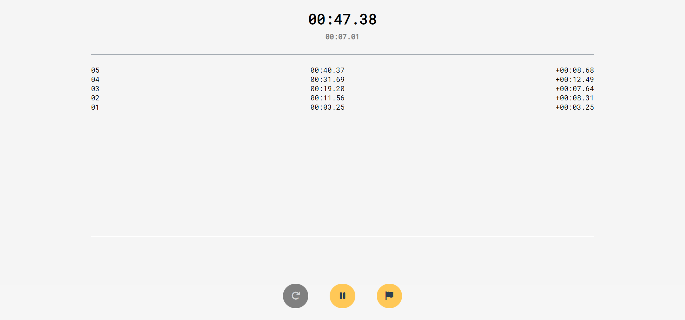

# ⏱ Ticker - A stopwatch

    

## [Demo](https://waterrmalann.github.io/ticker/)   |   [Source](https://github.com/waterrmalann/ticker/blob/main/js/script.js)

A clean, simple, and minimal web stopwatch with laps/flags that counts down to the millisecond. Supports pause and play. Laps are neatly recorded in a list view with the time difference between the lap (a live version of which also runs as a separate stopwatch under the main one). This tiny project was written in HTML, CSS, and vanilla JavaScript.

Fonts from [Google Fonts](https://fonts.google.com/) and Icons from [Font Awesome](https://fontawesome.com/).



---

### 🚀 Setup

A live and up-to-date version of the web app is available [here](https://waterrmalann.github.io/ticker/). If you wish to modify the app or host it yourself, you can clone the repo and do whatever you want with it.

1. [Clone the repository](https://docs.github.com/en/github/creating-cloning-and-archiving-repositories/cloning-a-repository-from-github/cloning-a-repository).

```sh
git clone https://github.com/waterrmalann/ticker.git
```

2. Install the dependencies.

```sh
npm install
```

3. This will start a live server. Head to the IP shown in the console.

```sh
npm run serve
```

---

### 🤝 Contribution

Contributions are always accepted. Feel free to open a pull request to fix any issues or to make improvements you think that should be made. You could also help me with the to-do list above. Any contribution will be accepted as long as it doesn't stray too much from the objective of the app. If you're in doubt about whether the PR would be accepted or not, you can always open an issue to get my opinion on it.

License
----

This project is licensed under the permissive **MIT License**, see [LICENSE](LICENSE)
